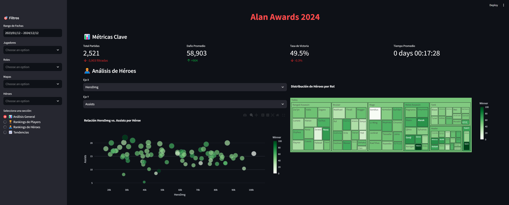

# Heroes of the Storm Analytics Dashboard

## 🎮 Overview
Advanced analytics dashboard for Heroes of the Storm gameplay data with comprehensive analytics, professional insights, and dynamic filtering capabilities.



**Live Demo**: [https://aa2024.streamlit.app](https://aa2024.streamlit.app)

## ✨ Key Features
- **📊 8 Analysis Sections**: Complete analytics suite from basic stats to advanced insights
- **🎨 Dynamic Themes**: Auto-switching themes for different datasets (2024/2025)
- **🔍 Smart Filtering**: Multi-criteria filters with real-time updates
- **📈 Professional Analytics**: Executive dashboards and statistical analysis
- **📊 Optimized Dataset**: Clean, structured data with 50,000+ game records
- **🦸‍♂️ Hero Analysis**: Comprehensive hero performance and role analysis

## 🚀 Quick Start

1. **Install dependencies:**
```bash
pip install -r requirements.txt
```

2. **The main dataset (`structured_data.csv`) is included** - no additional setup needed!

3. **Run the dashboard:**
```bash
streamlit run moba_dashboard.py
```

4. **Open** [http://localhost:8501](http://localhost:8501)

## 📊 Analysis Sections
| Section | Description |
|---------|-------------|
| 📊 Análisis General | Hero performance analysis with curated metrics |
| 🏆 Rankings de Players | Player performance leaderboards |
| 🦸‍♂️ Rankings de Héroes | Hero tier lists and win rates |
| 📈 Tendencias | Temporal analysis and gameplay patterns |
| 🚀 Analytics Profesional | Executive dashboards and KPIs |
| 🔍 Exploración de Datos | Interactive data exploration tools |
| 📋 Análisis de Composiciones | Team composition analysis |
| 🎯 Métricas Avanzadas | Deep statistical analysis and insights |

## �️ Tech Stack
- **Frontend**: Streamlit
- **Data Processing**: Pandas, NumPy  
- **Visualization**: Plotly
- **Statistics**: Advanced metrics and calculations

## 📁 Project Structure
```
heroes/
├── moba_dashboard.py          # Main dashboard application
├── structured_data.csv        # Primary dataset (optimized)
├── components/               # Dashboard components
│   ├── advanced_analytics.py
│   ├── composition_analysis.py
│   ├── data_exploration.py
│   ├── filters.py
│   ├── hero_analysis.py
│   ├── metrics.py
│   ├── professional_analytics.py
│   ├── rankings.py
│   ├── rankings_hero.py
│   └── time_analysis.py
├── utils/
│   └── data_loader.py        # Data loading and processing
├── tests/                    # Test suite
├── requirements.txt          # Dependencies
└── documentation/           # Project documentation
```

## 👨‍💻 Author
**Alan Yeverino** - [@Lanyev](https://github.com/Lanyev)

---
*Built for the Heroes of the Storm community with ❤️*
